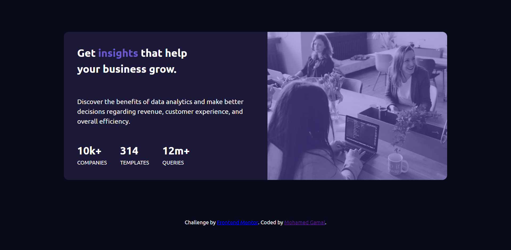

# Frontend Mentor - Stats preview card component solution

This is a solution to the [Stats preview card component challenge on Frontend Mentor](https://www.frontendmentor.io/challenges/stats-preview-card-component-8JqbgoU62). Frontend Mentor challenges help you improve your coding skills by building realistic projects. 

## Table of contents

- [Overview](#overview)
  - [Screenshot](#screenshot)
  - [Links](#links)
- [My process](#my-process)
  - [Built with](#built-with)
  - [What I learned](#what-i-learned)
- [Author](#author)

## Overview

### Screenshot

## Desktop View



## Desktop View


### Links

- Solution URL: [Add solution URL here](https://github.com/mgamalmohamed/frontend-mentor-projects/tree/main/stats-preview-card-solution)
- Live Site URL: [Add live site URL here](https://affectionate-bell-b1ca03.netlify.app)

## My process

### Built with

- Semantic HTML5 markup
- CSS custom properties
- Flexbox
- Mobile-first workflow

### What I learned

*Test my skills in HTML & CSS features.
*I learnt more of Flexbox usage for responsive design.

To see how you can add code snippets, see below:

```html
<h1>This is my first challenge</h1>
```
```css
.proud-of-this-css {
  color: papayawhip;
}
```
```js
const proudOfThisFunc = () => {
  console.log('🎉')
}
```

## Author

- Frontend Mentor - [@mgamalmohamed](https://www.frontendmentor.io/profile/mgamalmohamed)
- Twitter - [@MoJemmey](https://twitter.com/MoJemmey)
